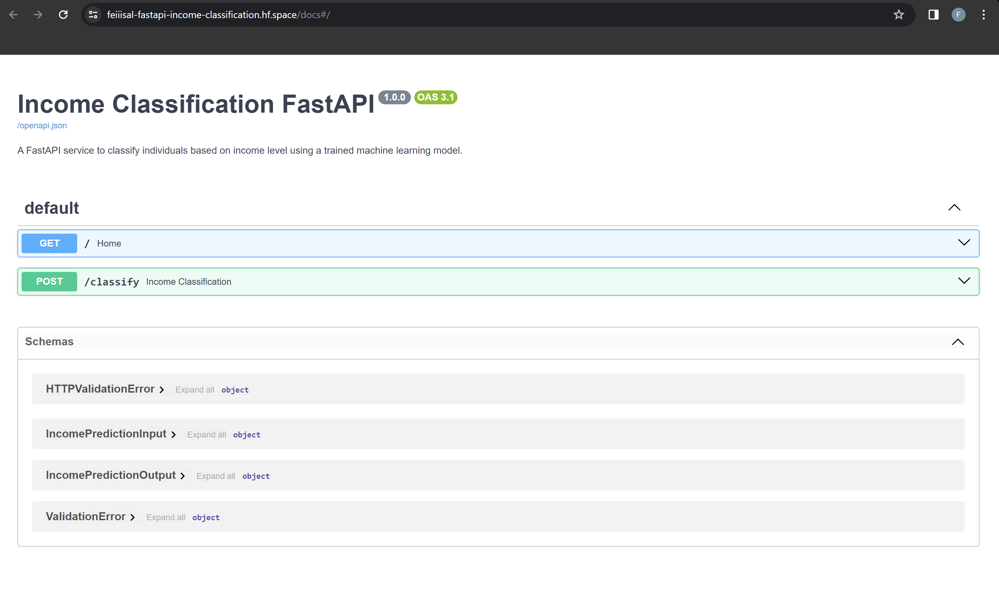
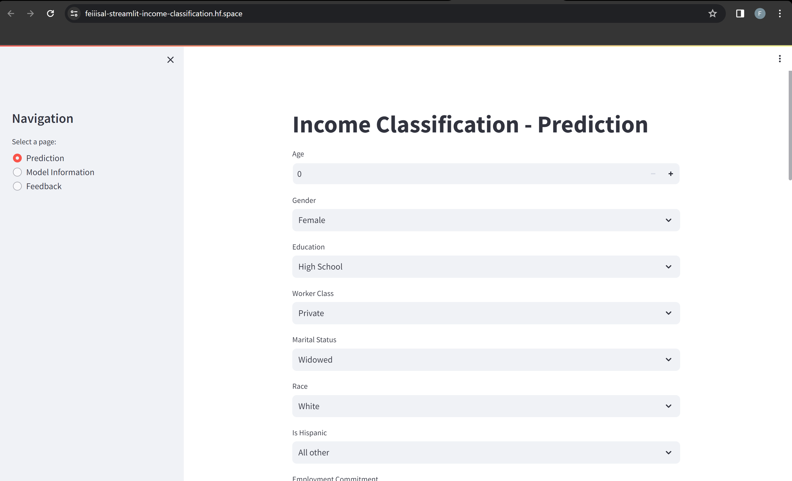

# Income Classification

[](LICENSE)


A machine-learning model that predicts whether a person's income falls above or
below a threshold from census-style attributes (age, education, occupation,
marital status and more), served through a **FastAPI** backend and a
**Streamlit** front end, both hosted on Hugging Face Spaces.

## Why it matters

Understanding the factors linked to income helps with economic research,
targeted services and policy design. The project also shows the full path from
a notebook to a deployed, containerised application.

## Try it

- **Streamlit app:** <https://feiiisal-streamlit-income-classification.hf.space/>
- **FastAPI docs:** <https://feiiisal-fastapi-income-classification.hf.space/docs>

| FastAPI | Streamlit |
|---|---|
|  |  |


## Model

The notebook compares several classifiers (including Random Forest, CatBoost,
LightGBM and XGBoost) on census data after cleaning, feature engineering and
class balancing. The **Random Forest** was selected:

| Model | Accuracy (39,301 test rows) |
|---|---|
| Random Forest | **0.98** |
| CatBoost | 0.97 |

## Repository contents

```
Dev/income.ipynb      Exploration, feature engineering, model comparison
Data.zip              The dataset
SRC/
  main.py             FastAPI service (model + preprocessing pipeline)
  app.py              Streamlit application
  transformers.py     Custom preprocessing transformer used by the pipeline
  Assets.zip          Saved model and pipeline (unzip to SRC/Assets)
Screenshots/          App screenshots
requirements.txt
```

## Setup

```bash
git clone https://github.com/Feiiiisal/Income_classification.git
cd Income_classification
pip install -r requirements.txt
```

Unzip `SRC/Assets.zip` into `SRC/Assets/` to get the saved model files. The
hosted apps above are the quickest way to try the project.

## Ethical considerations

Models that predict income can reflect biases in the data they were trained on.
Treat the output as a demonstration of the technique, not as a basis for
decisions about real people.

## License

[MIT](LICENSE)
